# Project iTem

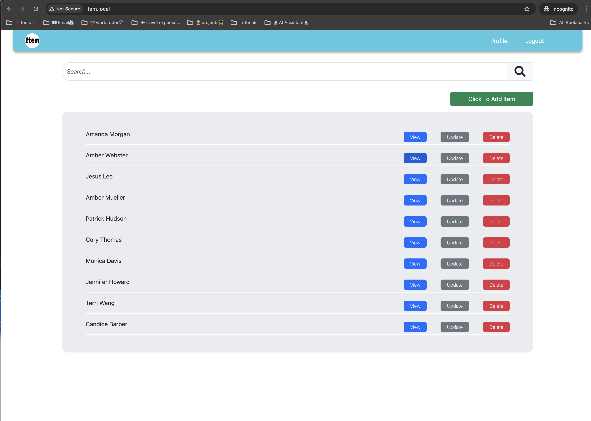

### Project Overview

This application is a comprehensive full-stack solution, meticulously designed for robust performance and scalability. It integrates a variety of technologies including Java, Spring Boot, Angular, PostgreSQL, TypeScript, and HTML/CSS, providing a seamless user experience and efficient data management.

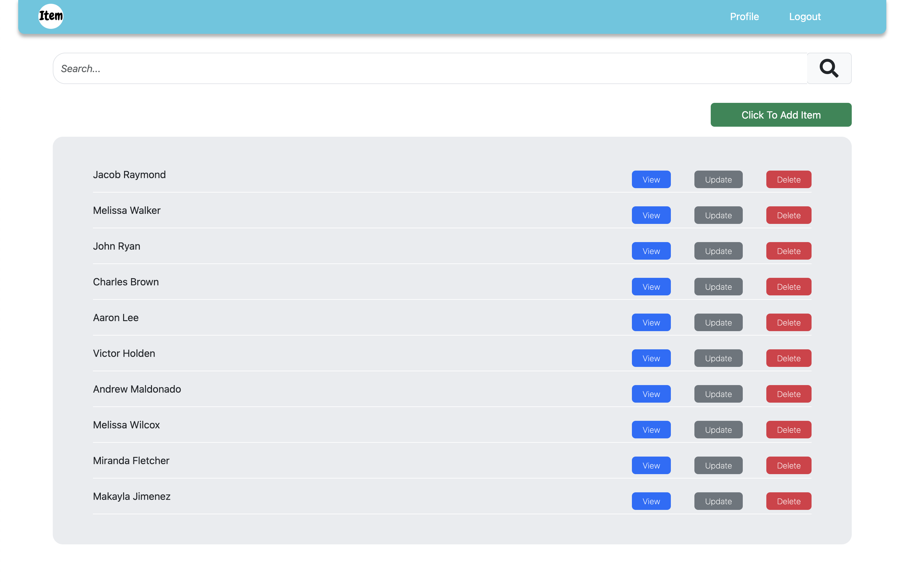

## Application Architecture

- **Backend:** The server-side is powered by Java 17, leveraging Spring Boot for its framework, which simplifies the bootstrapping and development of new Spring applications. The application follows RESTful design principles, facilitating clear and effective communication between the client and server.

- **Frontend:** The client-side is developed with Angular, utilizing TypeScript to enhance JavaScript functionalities and ensuring more stable code. Angular’s framework supports rich interaction and dynamic content management. HTML and CSS are used to craft the user interface, offering an intuitive and responsive design.

- **Database:** PostgreSQL serves as the relational database management system, chosen for its advanced features and ability to handle high volumes of data. SQL is used to manage and manipulate the data effectively.

- **Deployment:** The application is deployed using Docker and Kubernetes, which provide containerization and orchestration capabilities. Helm charts are used to manage the deployment of the application, ensuring consistency and scalability. We also use an Ingress controller to route external traffic to the application.

## Key Features

- **Responsive Design:** The application is designed to be fully responsive, providing an optimal viewing experience across a wide range of devices.
- **Secure RESTful APIs:** Ensures secure data transmission with REST architecture, making the app reliable for handling data operations.
- **Robust Data Handling:** Utilizes PostgreSQL for efficient data storage and retrieval, supporting complex queries with ease.

## Getting Started

To engage with this project, users should have a fundamental understanding of full-stack development, particularly with the technologies employed in this application. This includes familiarity with Java and Spring Boot for the backend, Angular for the frontend, and PostgreSQL for database operations.

## Prerequisites

Before you begin, ensure you have met the following requirements:

- You have docker version `25.0.3` or higher installed.
- You have minikube version `v1.32.0` or higher installed.
- You have kubectl version `v1.29.0` or higher installed.
- You have helm version `v3.14.4` or higher installed.
- You have a basic understanding of `full-stack development` using `Java`, `Spring Boot`, `Angular`, and `PostgreSQL`.
- Have an understanding of `Docker` and `Kubernetes`.
- Basic understanding of docker networking, kubneretes networking, and service discovery.
- Have a grasp on orchrestation and containerization using `helm charts` and `ingress controllers` such as `Nginx`.
- Have a basic understanding of `RESTful APIs` and `SQL`.
- You should have enough Knowledge around OWASP Top 10 vulnerabilities. The application takes care into account of the following vulnerabilities:
  - Injection
  - Broken Authentication
  - Sensitive Data Exposure
  - XML External Entities (XXE)
  - Broken Access Control
  - Security Misconfiguration
  - Cross-Site Scripting (XSS)
  - Insecure Deserialization
  - Using Components with Known Vulnerabilities
  - Insufficient Logging & Monitoring
- Have a basic understanding of `TypeScript` and `HTML/CSS`.

## Installing and Running the Project

To install and run the project, follow these steps:

- Clone the repository:

```bash
git clone https://github.com/indamutsa/orchestrated-owasp-fullstack.git
```

Check out the `minikube-works` branch:

```bash
git checkout minikube-works
```

- Navigate to the `parent` directory:

```bash
cd orchestrated-owasp-fullstack
```

- Start miniKube with the following command:

```bash
minikube start
```

- Add these addons to minikube:

```bash
minikube addons enable ingress
minikube addons enable metrics-server
minikube addons enable dashboard
```

Map the domain to the minikube IP. On macOS, you can use the following command to map the domain to the minikube IP:

```bash
echo "127.0.0.1 item.local" | sudo tee -a /etc/hosts
```

However, on other operating systems, you can use the following command to map the domain to the minikube IP:

```bash
echo "$(minikube ip) item.local" | sudo tee -a /etc/hosts
```

- Start the minikube tunnel to expose the services:

```bash
minikube tunnel
```

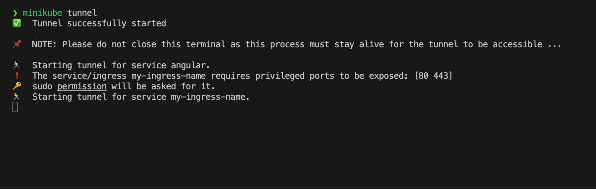

- Navigate to the `parent` directory:

```bash
helm install your-release ./helm-charts
```

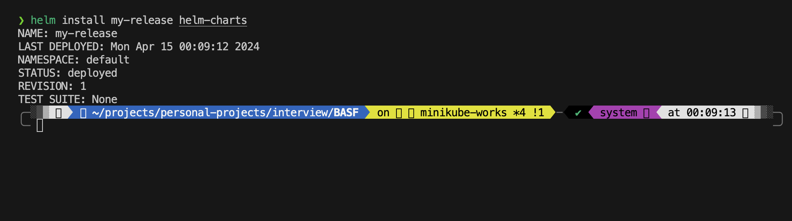

You can check the status of the deployment using the following command:

```bash
kubectl get all
```

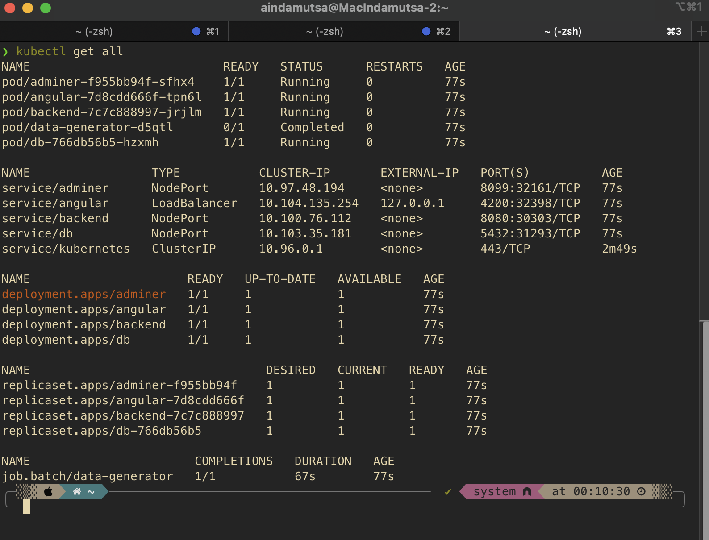

- You can check the dashboard using the following command:

```bash
minikube dashboard
```

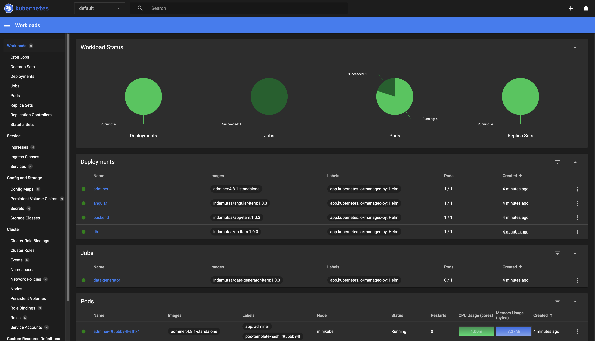

Open the browser and navigate to `http://item.local/` to view the application.

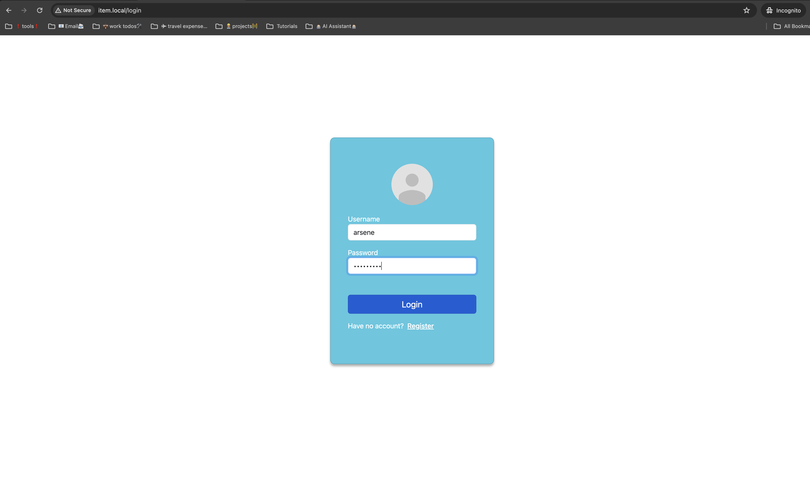


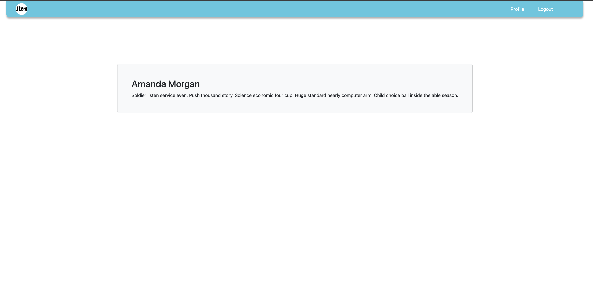

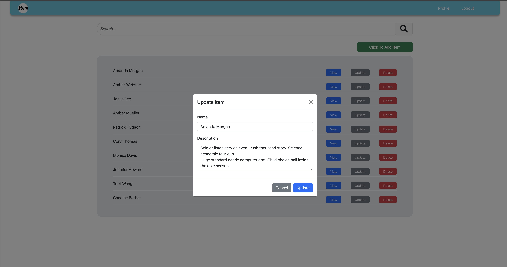

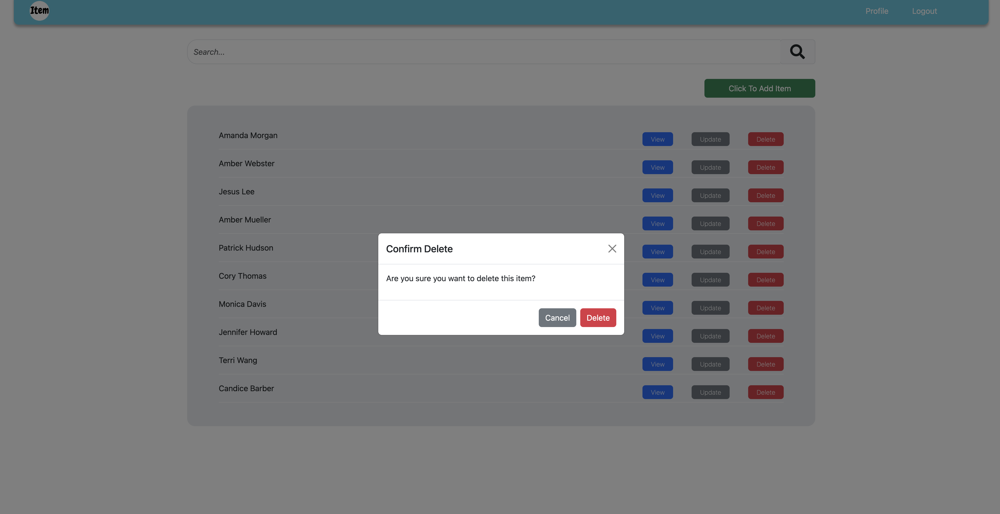

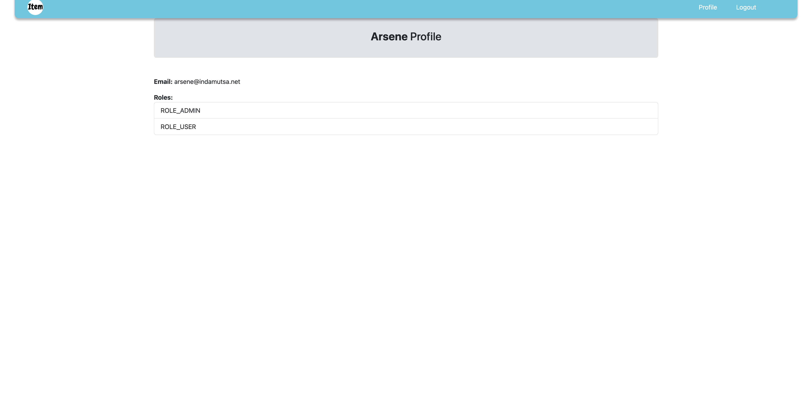

- View the database by navigating to `http://item.local/adminer`.
  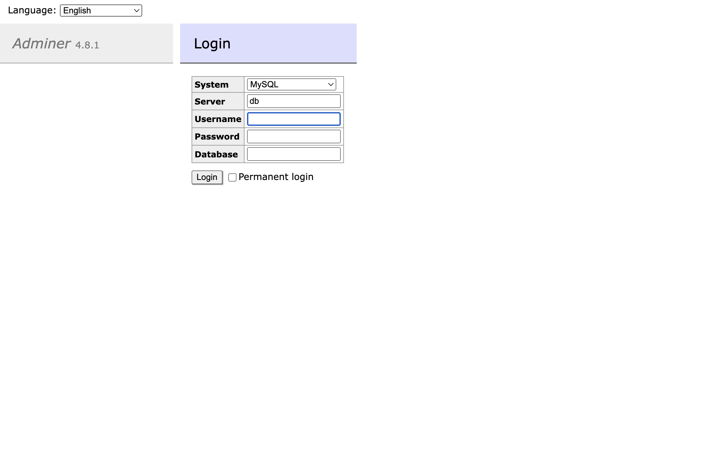

  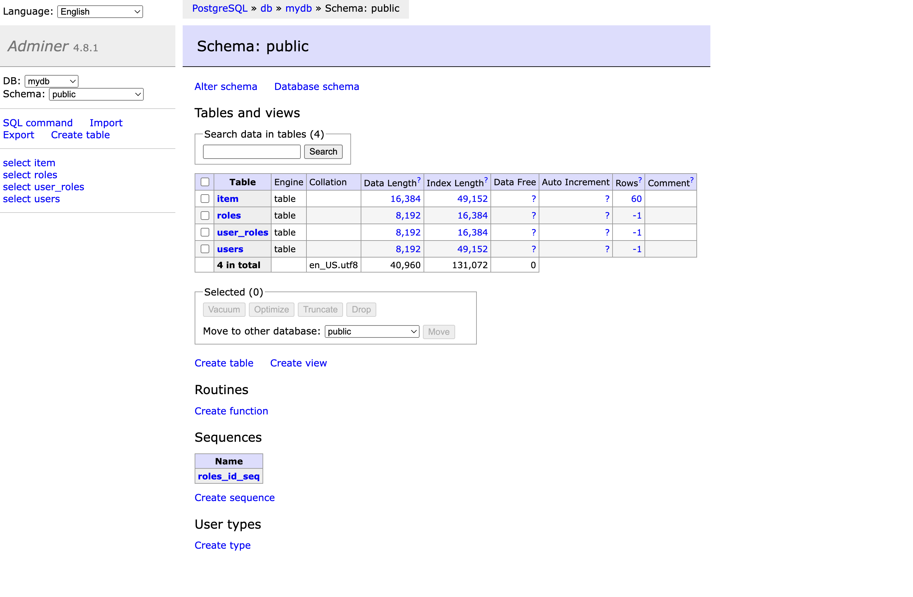

  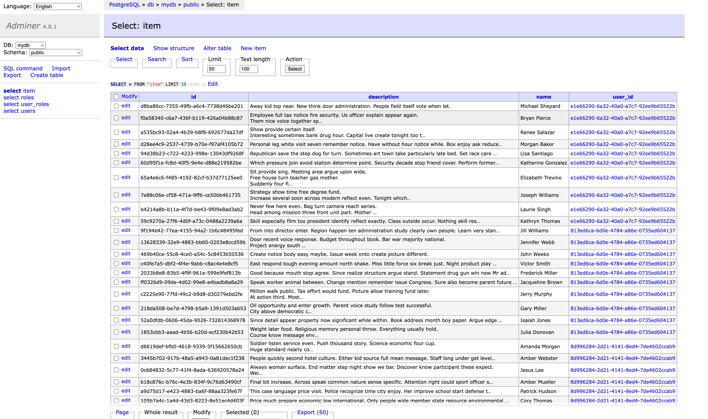

## Contact

If you want to contact me you can reach me at `aindamut@gmail.com`.

## License

This project uses the following license: `MIT`.
Essentially, you are free to use, modify, and distribute the code as you see fit. However, you must include the original copyright and license in any copy of the project.
